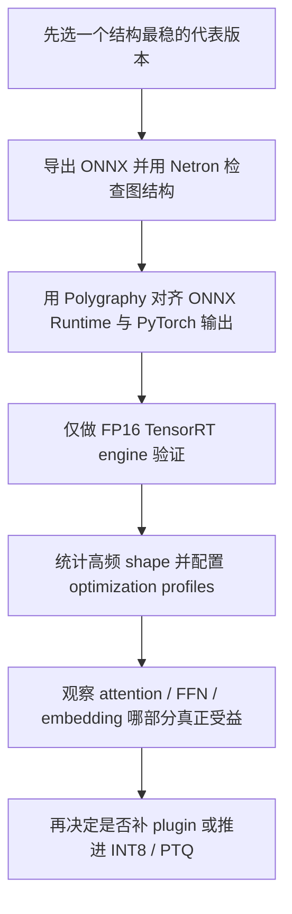

# TensorRT 讲座推理性能优化策略整理

> 整理日期：2026-07-08  
> 依据材料：本次提供的现场拍照图片与录音转写人工整理  
> 适用范围：`/Users/sunyiyang/Desktop/Project/Baidu  GRAB/submission` 当前各版本方法线的后续推理加速规划

## 1. 本批材料的演讲内容统计

这批材料的核心不是单点技巧，而是一条完整的 CTR 推理优化链路。录音补充了很多图片上没有展开的工程细节。按主题可归为 8 个方向：

| 主题 | 图片数 | 演讲重点 |
|---|---:|---|
| 版本迭代方法 | 0 | 每轮只改一个变量，并把性能、效果、显存、稳定性、可复现性连成闭环 |
| Profiling 分析方法 | 0 | 用 Nsight Systems 看 GPU 气泡、H2D/D2H 重叠、同步、短 kernel 和热点排序 |
| CTR 链路瓶颈 | 0 | embedding、attention、动态 shape 是推荐推理的三大主瓶颈 |
| 部署路径选择 | 2 | `Torch-TensorRT`、`TRT Model Convert`、原生 TensorRT 三条路径的易用性与定制化权衡 |
| 编译期优化 | 2 | `ONNX/Network -> Builder -> Engine`，重点是图优化、算子融合、`IOptimizationProfile`、`IBuilderConfig` |
| 运行期执行 | 1 | plan 反序列化、显存/缓冲区管理、`IExecutionContext` 多实例并行执行 |
| 进阶特性 | 2 | 动态 shape、refit、plugin、algorithm selector、timing cache、INT8 |
| 低精度工具链 | 2 | 精度路线、ModelOpt 中的 PTQ / QAT / Pruning / Distillation / Export |
| 调试验证工具链 | 1 | `Netron`、`ONNX GraphSurgeon`、`Polygraphy` 的分工与使用方式 |

### 1.1 逐页主旨

1. 部署路径选择：从易用优先到极致定制，依次是 `Torch-TensorRT`、`TRT Model Convert`、原生 TensorRT。
2. TensorRT 加速链路：优化分为编译期和运行期，两者都影响最终延迟。
3. 从模型到 Engine：训练模型可以走 ONNX、Torch-TensorRT 或 Convert 路线，最终进入 TensorRT Optimizer 与 Runtime。
4. TensorRT 11.0 新特性：MoE 原生支持、多 GPU、`IPluginV3`、更顺滑的 Hugging Face / PyTorch 模型接入。
5. 编译期重点：`INetwork` 描述图，`Builder` 通过 profile 和 config 决定编译出的 engine 质量。
6. 运行期重点：engine 反序列化后，真正的性能落点在缓冲区、上下文和执行队列组织方式。
7. 进阶特性：动态 shape、plugin、timing cache、算法选择器、INT8 量化。
8. ModelOpt：量化、剪枝、蒸馏不是孤立动作，而是完整的低精度部署工具链。
9. ONNX -> TensorRT 调试链：先看图，再改图，再做数值回归验证。

### 1.2 录音补充出的关键原则

录音里比图片更有价值的，是下面这几条工程原则：

1. 每一轮实验只改一个变量。  
   否则最后分数变化无法归因，也无法沉淀可靠结论。

2. 每轮验证不能只看速度。  
   还要同时看效果、显存、稳定性、可复现性。

3. 优化必须形成闭环。  
   先测量，再定位当前瓶颈，优化后确认原瓶颈是否真的消失，再进入下一轮。

4. Nsight Systems 不只是截图工具。  
   重点要查 5 件事：GPU timeline 气泡、H2D/D2H 是否和计算重叠、是否有频繁同步、是否存在大量短 kernel、热点 kernel 总耗时排序。

5. 低精度路线有明确顺序。  
   `FP32` 是数值参考，`FP16/BF16` 应先跑通部署 baseline，之后才是 `INT8 W8A8`，最后才考虑 `INT4 weight-only` 这类更激进方案。

## 2. 从演讲中抽出的推理性能优化策略

下面只保留对当前 GRAB submission 真正有操作意义的策略，不写泛泛概念。

| 策略 | 核心作用 | 对当前项目的意义 | 主要风险 |
|---|---|---|---|
| 每轮只改一个变量并做闭环验证 | 让结论可追溯、可复现 | 当前本地 submission 版本很多，后续如果再做 TensorRT 或低精度尝试，必须避免多变量叠加导致误判 | 迭代速度看起来会变慢，但结论更稳 |
| 先做 profiling 再做实现 | 把时间花在最大热点上 | 录音明确建议按 kernel 总耗时排序做优化，这比凭感觉改代码有效 | 如果采样场景不准，会优化错热点 |
| embedding 优化优先考虑访存而非算力 | 解决 memory-bound 问题 | 对 CTR 类任务尤其关键，适用于当前大 embedding / 稀疏 ID 访问场景 | 需要较多工程和数据分布分析 |
| 长序列 attention 先消 padding 再选 kernel | 先减少无效 token 计算，再匹配最佳 kernel | 当前项目 attention 已经是主瓶颈之一，这条比继续抠 `permute` 更有价值 | pack/jagged 会增加索引和实现复杂度 |
| 动态 shape 必须做 bucket + warmup | 避免首次推理慢和多 shape 抖动 | 和当前 compile / CUDA graph 失败经验高度一致 | bucket 设计不当会损伤收益 |
| 先选部署路径，再谈细节优化 | 避免在不适配的技术栈上空耗时间 | 先判断当前 `infer.py` 是否值得走 ONNX/TensorRT，而不是默认继续在 eager mode 里抠微优化 | 算子不兼容、导出成本高 |
| 编译期图优化前置 | 把常量折叠、死代码删除、融合交给 engine build 阶段 | 当前很多版本已经证明 eager mode 微优化收益有限，后续应更多考虑图级优化 | 动态 shape、多分支结构会放大 build 复杂度 |
| 动态 shape 必须做 bucket/profile 化 | 避免频繁重编译和 engine 泛化过宽导致性能劣化 | 当前 submission 有明显的 batch / 序列长度波动，这正是 TensorRT profile 的典型适用点 | profile 过宽会损失性能，过窄会回退或重建 |
| 运行期做预分配和上下文复用 | 降低每次推理的显存管理和 launch 组织开销 | 比单纯改算子更稳，尤其适合固定服务流程 | 需要工程化改造，不是单文件小修 |
| 先做 FP16/BF16 基线，再考虑 INT8 | 低风险换吞吐，避免过早陷入量化细节 | 当前仓库已有 FP16 路线经验，适合作为 TensorRT 的第一步 | INT8 误差、反量化开销、校准集覆盖不足 |
| 对敏感层做保护或混合精度 | 控制低精度精度损失 | 新增图片明确建议敏感层不要一刀切降精度，这对 AUC / PCOC 很关键 | 需要定位敏感层并维护额外配置 |
| PTQ 不够再上 QAT | 先走低成本路径 | 当前项目是竞赛型快速迭代，更适合先做 PTQ 可行性判断 | QAT 成本高，且可能超出当前提交边界 |
| plugin 只解决确定的算子缺口 | 让不兼容模块进入 TensorRT 路线 | 当前 SMoE / 稀疏路由 / 自定义 attention 如果卡在 ONNX 兼容性上，plugin 是后手 | 开发成本高，调试难度大 |
| timing cache / algorithm selector | 让重复 build 更稳定，减少试错成本 | 当前版本族多、实验频繁，适合沉淀 build cache | 需要固定硬件和稳定 build 环境 |
| ONNX 图检查和数值对比成为固定流程 | 防止“跑得快但结果漂” | 当前项目非常依赖 AUC / PCOC 合规，必须把数值回归前置 | 增加实验流程复杂度 |

## 3. 与当前 submission 的对应关系

结合 [`docs/提交记录_分数_方法_论文索引.md`](/Users/sunyiyang/Desktop/Project/Baidu%20%20GRAB/docs/提交记录_分数_方法_论文索引.md)，当前本地版本可以分成几条与 TensorRT 强相关的方法线：

### 3.1 版本迭代与验证纪律

- 当前问题：
  - 本地 `submission/` 版本数量已经很多，方法线彼此交叉，天然容易出现多变量叠加。
  - 一旦把结构改动、精度改动、编译改动同时混入一个版本，就很难判断收益到底来自哪里。
- 对应策略：
  - 后续凡是做 TensorRT、低精度、shape bucket、plugin、packing，都建议一次只验证一个维度。
  - 每个版本至少记录 5 个指标：延迟、AUC/分数、PCOC、显存、稳定性/可复现性。
  - 任何“更快但结果漂”的方案都不能直接吸收进主线。

### 3.2 Embedding 路径

- 代表版本：`V24-SPARSE-EMB-sxyq`、`V16-FP16EMB-sxyq`
- 录音补充出的结论：
  - embedding 是典型 memory-bound 场景，不是纯算力问题。
  - 真正值得做的是减少 lookup、缩紧 index 类型、压低 value 精度，以及把 lookup/pooling/concat 尽量融合。
- 对应策略：
  - 统计高频重复 ID，评估去重收益。
  - 检查当前索引是否存在 `int64 -> int32` 收紧空间。
  - 如果后续做 TensorRT 或自定义 kernel，优先考虑 embedding 查表后处理融合，而不是只换 dtype。

### 3.3 Attention 与长序列路径

- 代表版本：`V103-PER-USER-CAUSAL-SDPA-sxyq`、`V139-FLASH-ATTN-sxyq`、`V143-PERMUTE-OPT-sxyq`
- 结论：
  - 这条线已经证明 attention 是主要瓶颈之一。
  - eager mode 下的 `permute`、小张量组织类微调收益很小。
  - 录音进一步说明，真正该先做的是统计长度分布、去 padding、再匹配合适 kernel。
- 对应策略：
  - 优先确认 attention 主路径能否稳定导出 ONNX。
  - 如需动态长度，按常见 `seq_len` 做有限 bucket，而不是给一个过宽 profile。
  - 如后续继续做 attention 优化，优先考虑 packed/jagged layout 的收益评估，而不是继续做细碎 eager 微调。

### 3.4 SMoE / 稀疏路由路径

- 代表版本：`V104-PER-USER-SDPA-BATCHED-SMOE`、`V109-DENSE-SMOE-sxyq`、`V146-SPARSE-OPT-sxyq`、`V150-GROUPED-BMM-sxyq`、`V151-NO-SYNC-BMM-sxyq`、`V152-PREALLOC-BMM-sxyq`
- 结论：
  - 当前历史结果已经说明：在 PyTorch eager mode 中，稀疏 dispatch / gather / sort 的管理开销经常大于计算节省。
  - `V109` 这类“把不规则计算重新整理成更密的 GEMM”反而更有效。
- 对应策略：
  - 如果走 TensorRT，优先考虑“更规整的 dense/batched 形态”进入 engine，而不是把现有稀疏调度逻辑原样搬过去。
  - 若 ONNX 卡在路由或自定义算子上，再评估 plugin，而不是一开始就写 plugin。

### 3.5 Compile / Warmup / 图捕获路径

- 代表版本：`V142-COMPILE-SMOE-sxyq`、`V149-CUDA-GRAPH-sxyq`、`V166-CUDA-GRAPH-sxyq`、`V169-HYBRID-SVD-sxyq`
- 结论：
  - 当前仓库已经反复验证：没有 shape 管理和 warmup 机制，compile / graph capture 很容易失效。
  - 录音里明确建议把变长 shape 归成有限 bucket，并对每个 bucket 单独预热。
  - 这和讲座里的 `IOptimizationProfile`、timing cache、运行期上下文复用是同一类问题。
- 对应策略：
  - 未来若尝试 TensorRT，第一优先级不是“全量转换”，而是先梳理输入 shape 分布。
  - 用 profile 覆盖高频区间，用 warmup 预先完成 engine 选择和缓存建立。

### 3.6 低精度与量化路径

- 代表版本：`V16-FP16EMB-sxyq`、`V105-ALL-IN-INT8`、`V147-INT8-QUANT-sxyq`、`V165-INT8-DENSE-sxyq`
- 结论：
  - 当前结果已经显示：在 eager mode 下，INT8 并不自动变快，反而可能因反量化和访存组织而更慢。
  - 新图片把顺序说得更明确：`FP32` 仅作数值参考，先站稳 `FP16/BF16` baseline，再做 `INT8 W8A8`，最后才考虑 `INT4 weight-only`。
  - 录音和图片都强调：PTQ 优先于 QAT，对敏感层要保护或保留混合精度。
- 对应策略：
  - TensorRT 路线下先做 FP16 engine baseline。
  - 只有在 profiler 明确显示权重带宽或 dense GEMM 为主瓶颈时，才考虑 weight-only INT8 或 PTQ。
  - 校准样本必须覆盖常见 batch、长尾 ID、不同序列长度和异常输入。
  - 如果 PTQ 后 AUC / PCOC 不稳，再考虑只对非敏感层降精度，而不是全模型一刀切。

### 3.7 剪枝 / SVD / 结构压缩路径

- 代表版本：`V153-PRUNE-FFN-sxyq`、`V168-SVD-LOWRANK-sxyq`、`V169-HYBRID-SVD-sxyq`、`V170-ADAPTIVE-SVD-sxyq`、`V171-SVD-R64-sxyq`、`V176-FFN-PRUNE-sxyq`
- 结论：
  - 这条线是当前最值得和 TensorRT 结合的方向，因为它本质上是在减少真实计算量，而不是做表层调度优化。
  - 讲座里的 ModelOpt 路线和本地已有的剪枝 / 低秩实验高度一致。
- 对应策略：
  - 先把“结构压缩后的模型”作为 TensorRT 输入，而不是先转 TensorRT 再想办法压缩。
  - 后续可评估：FFN 剪枝 + SVD 后，TensorRT 是否能进一步把剩余 GEMM 融合到更优 kernel。

## 4. 对当前项目最有价值的优化方向排序

### P0：建议立刻做

1. 把后续优化实验严格收敛为“单变量改动 + 闭环验证”  
   这是录音里最重要的工程纪律，否则版本越多，误判越多。

2. 建立 `PyTorch -> ONNX -> 数值回归` 的最小验证链  
   目的不是马上提速，而是先判断主模型是否有 TensorRT 可行性。

3. 统计线上常见输入 shape，设计少量 bucket  
   当前 compile 失败历史已经表明，shape 不收敛时任何编译型优化都不稳。

4. 先做 FP16/BF16 TensorRT 可行性验证  
   不直接碰 INT8，先看 attention、FFN、embedding 路径能否稳定进入 engine。

5. 用 Nsight Systems 固化热点排序和气泡分析流程  
   每次优化前先看 GPU 气泡、同步、H2D/D2H 重叠和短 kernel 分布。

6. 用 `Netron + Polygraphy` 固化检查流程  
   一旦出现 AUC / PCOC 漂移，先判断是导出问题、图改写问题，还是精度问题。

### P1：值得继续投入

1. 对 SMoE / 稀疏路由做“规整化后再部署”的改造  
   重点不是保持当前实现细节，而是让热点计算尽量落成规整的 GEMM。

2. 引入 timing cache 和固定 builder config  
   当前版本实验次数多，这会直接减少重复 build 的成本。

3. 评估 FFN 剪枝 / SVD 后的 TensorRT 编译收益  
   本地已有结构压缩成果，最可能形成“减少 FLOPs + 更优 kernel”的双重受益。

### P2：中长期方向

1. 针对不兼容模块补 plugin
2. 尝试 PTQ / weight-only INT8
3. 若后续模型继续沿 MoE 深化，再关注 TensorRT 11.x 的原生 MoE 支持

## 5. 一个更务实的落地路线

不建议直接把当前所有 submission 版本都往 TensorRT 上搬。更合理的顺序是：

建议优先从这两类版本挑代表：

- 结构压缩主线：`V169-HYBRID-SVD-sxyq`、`V176-FFN-PRUNE-sxyq`
- attention 主线：`V139-FLASH-ATTN-sxyq`

原因很简单：

- `V169/V176` 代表当前最强的“真实减少计算量”方向；
- `V139` 代表 attention 优化基线，适合作为 TensorRT attention 收益对照；
- 稀疏路由主线目前工程复杂度高，不适合作为第一批 TensorRT 验证对象。

## 6. 需要明确避免的误区

1. 不要把“TensorRT 一定更快”当成前提。  
   如果主瓶颈在稀疏调度、shape 抖动、数据搬运，TensorRT 不会自动解决。

2. 不要在没有数值回归的情况下直接测速度。  
   当前项目是竞赛提交场景，AUC / PCOC 合规比局部吞吐更重要。

3. 不要过早做 INT8。  
   本地历史已经证明 eager mode 下 INT8 可能更慢，TensorRT 下也必须先过校准和精度检查。

4. 不要把所有动态输入塞进一个超宽 profile。  
   这样通常既拿不到最优 kernel，也会让 build 和 runtime 选择变差。

5. 不要把 plugin 当默认解。  
   只有在 ONNX 导出已经稳定、且确认某个关键算子阻断 TensorRT 路线时才值得投入。

## 7. 最终判断

这次讲座对当前 GRAB submission 最有价值的，不是“换一个推理框架”本身，而是提供了一套更成熟的判断顺序：

1. 先判断模型能否规整地进入编译式推理；
2. 再用 profile、cache、runtime context 管理动态输入；
3. 最后再做量化、plugin 和更激进的部署优化。

对当前仓库而言，最值得承接这套思路的不是历史上那些 eager mode 微优化失败分支，而是：

- `V169/V176` 这类结构压缩分支；
- `V139` 这类 attention 主线分支；
- 以及后续任何能够把不规则路由进一步规整为 dense GEMM 的版本。
